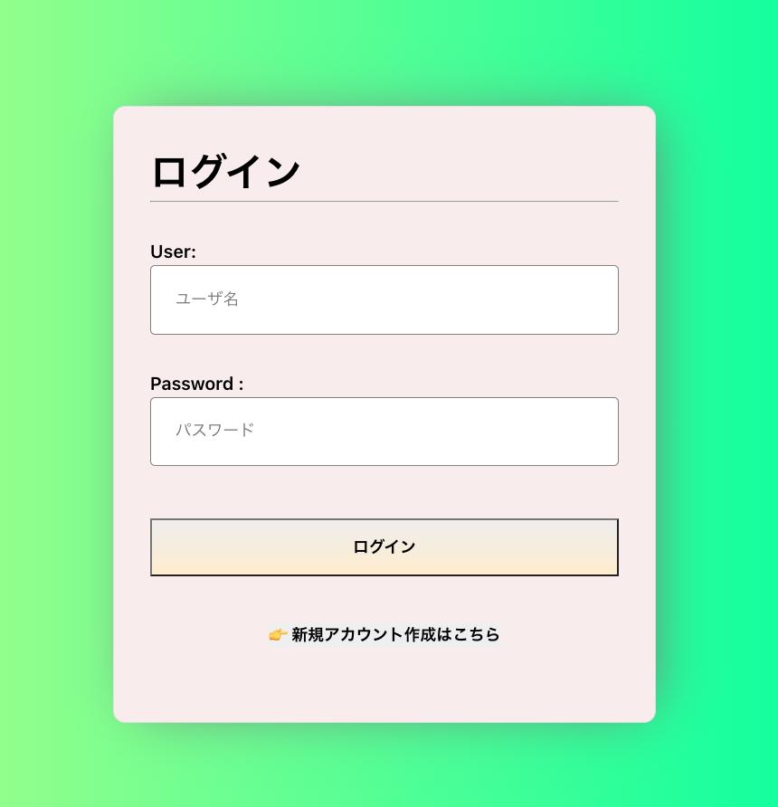

# Review App概要

## <strong> <h1>Step1 </h1> </strong>

<h2>ログイン画面からレビューアプリにログイン。アカウント作成していない方はログイン画面の下部に表示されている「アカウント作成」ボタンをクリック。</h2>

## <strong> <h1>Step2 </h1></strong>
<h2>ログインが完了するとメイン画面に遷移します。メイン画面ではユーザが今まで投稿してきたレビューが一覧表示されます。レビュー画面の右上のえんぴつボタンをクリックすると、レビューの編集画面が表示されます。
ゴミ箱ボタンをクリックするとレビューの削除ができます。</h2>

## <strong> <h1>Step3</h1> </strong>
<h2>左上のハンバーガーボタンをクリックするとサイドバーが表示されます。</h2>

<h2>レビュー投稿をクリックすると、下部に表示されているようなレビュー投稿フォームに遷移する。</h2>

<h2>お気に入りをクリックすると、他ユーザが投稿したレビューに対していいねを押した投稿の一覧が表示される。</h2>

